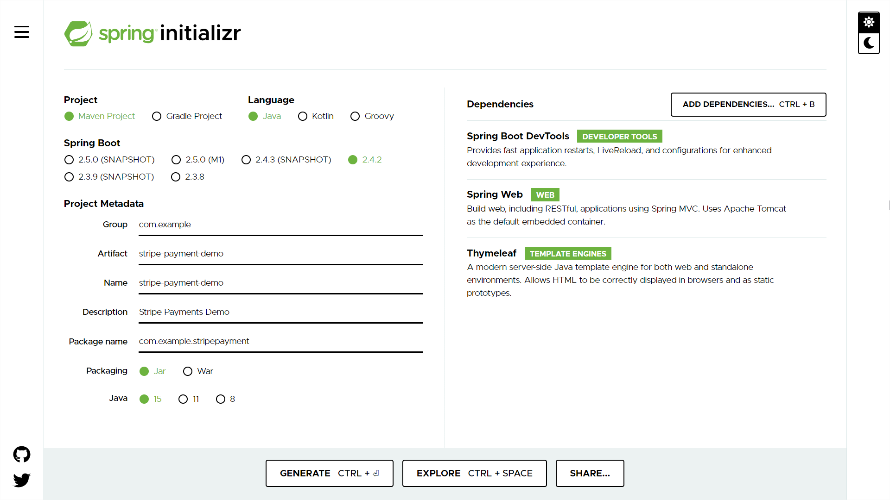
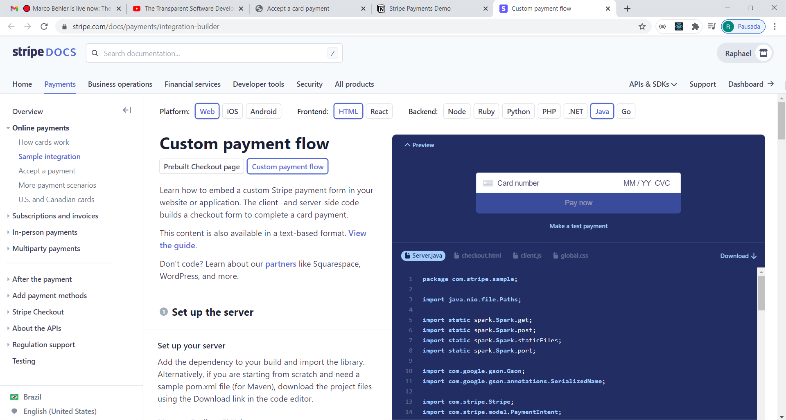
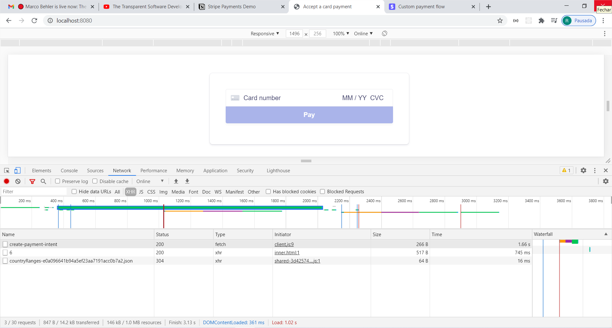
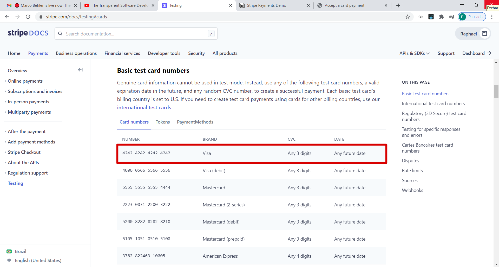
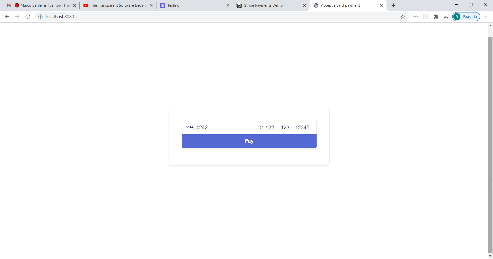
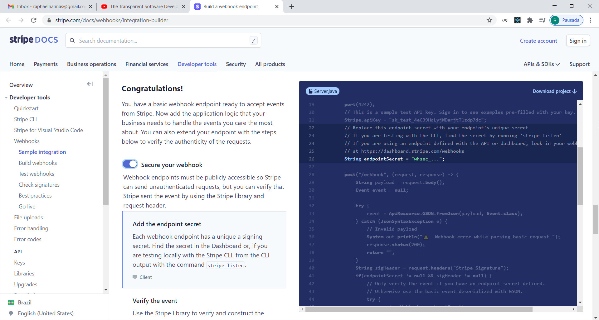

# Stripe Payments Demo

Tutorial idealizado por Marco Behler para criação de uma aplicação web para integração com a plataforma de pagamentos Stripe.

# Referências

[Accept online payments](https://stripe.com/docs/checkout/integration-builder)

[Building a real payment integration with Stripe to handle credit card payments](https://youtu.be/BIDNKRluql4)

# Atualização da versão da API Stripe

1. Acesse [Stripe →](https://dashboard.stripe.com/login)
2. Clique em **Developers**
3. Clique no botão **Upgrade available**
4. Clique no botão **Upgrade**

# Configuração do projeto

1. Acesse [Spring Initializr →](https://start.spring.io)
2. Configure conforme a imagem abaixo:

   

3. Clique no botão **GENERATE**

# Implementação da página de checkout

1. Acesse a página [Custom payment flow →](https://stripe.com/docs/payments/integration-builder)
2. Acesse o código conforme imagem abaixo:

   

3. Copie o código disponível nessa página para a aplicação

# Inspeção da página de checkout

1. Acesse a página [Accept a card payment →](http://localhost:8080)
2. Clique com o botão direito na página
3. Clique em **Inspecionar**
4. Acesse as informações a respeito da página em questão conforme imagem abaixo:

   

O **Chrome DevTools** poderá ser acessado também com a combinação de teclas **Ctrl+Shift+I**

# Teste relacionado à página de checkout

1. Acesse a página [Basic test card numbers →](https://stripe.com/docs/testing#cards)
2. Copie os dados do cartão disponíveis nessa página conforme imagem abaixo:

   

3. Acesse a página [Accept a card payment →](http://localhost:8080)
4. Especifique os dados do cartão conforme imagem abaixo:

   

5. Clique no botão **Pay**

# Implementação do webhook

1. Acesse a página [Build a webhook endpoint →](https://stripe.com/docs/webhooks/integration-builder)
2. Clique no botão **Secure your webhook**
3. Acesse o código conforme imagem abaixo:

   

4. Copie o código disponível nessa página para a aplicação

# Teste relacionado ao webhook

1. Acesse a página [Test a webhook endpoint →](https://stripe.com/docs/webhooks/test)
2. Faça o downlaod do **Stripe CLI**
3. Copie o arquivo **stripe.exe** para a pasta **C:\Program Files (x86)\Stripe**
4. Faça a inclusão do path acima na variável de sistema **Path**
5. Abra o **PowerShell**
6. Execute:

    ```powershell
    $ stripe login
    ```

7. Conceda acesso à conta ao **Stripe CLI**
8. Execute:

    ```powershell
    $ stripe listen --forward-to localhost:8080/stripe/events
    ```

9. Copie o **webhook signing secret**
10. Acesse a página [Accept a card payment →](http://localhost:8080)
11. Verifique o log gerado pela aplicação

# Geração do arquivo .jar

1. Abra o **IntelliJ IDEA**
2. Clique no painel **Maven**
3. Clique em **Lifecycle**
4. Dê duplo clique em **Package**